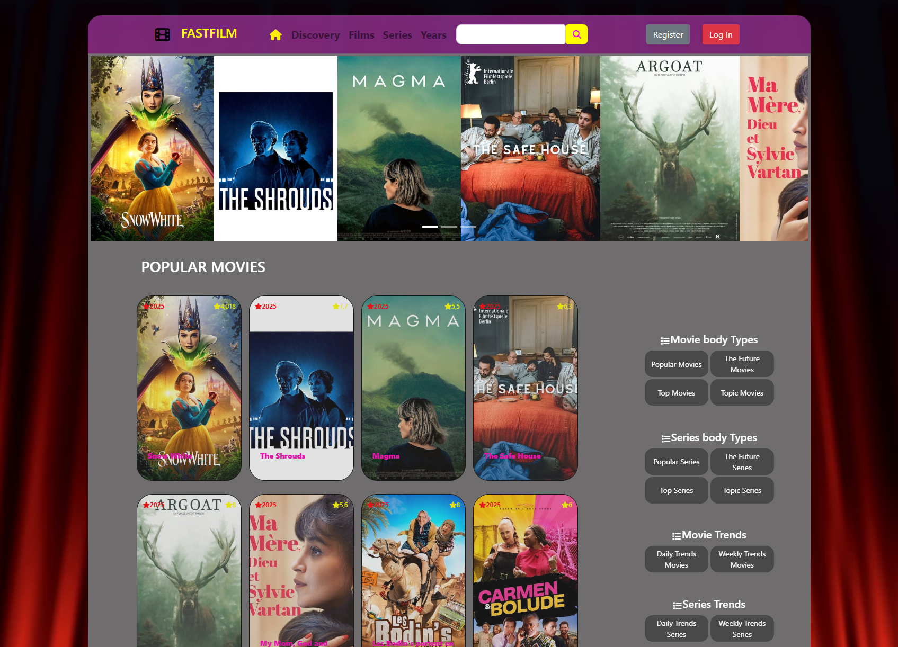
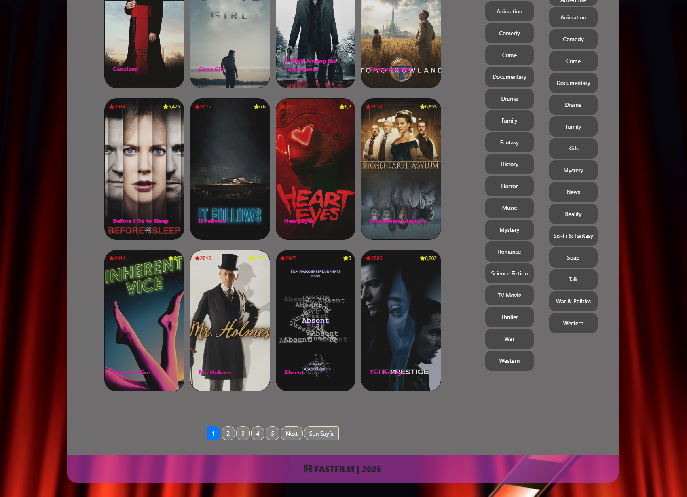
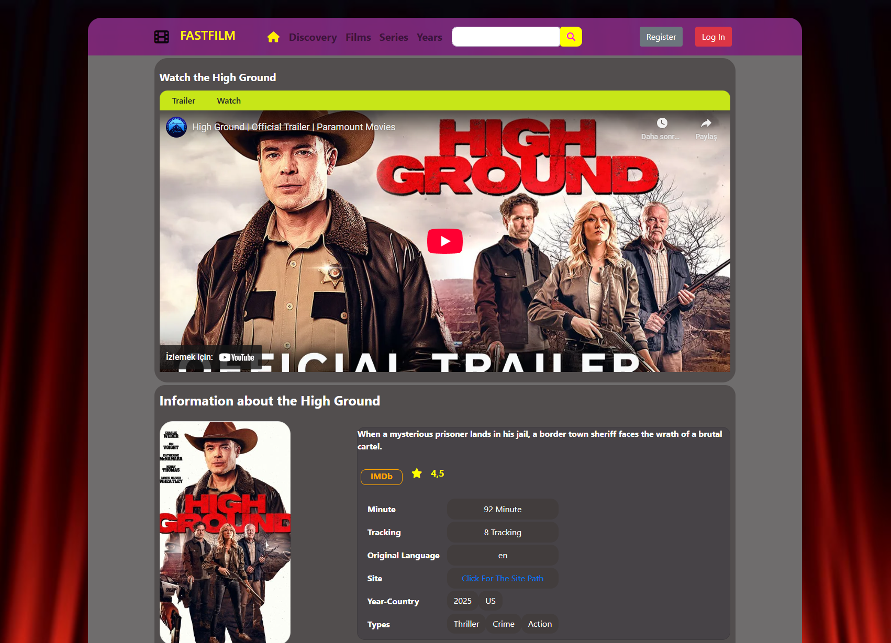
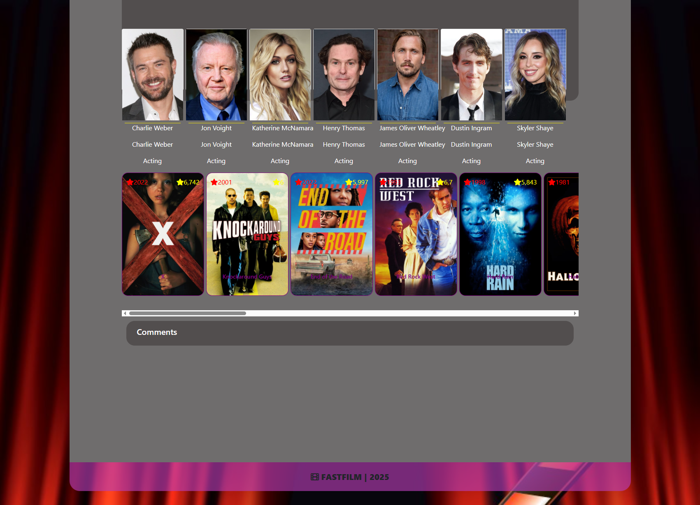

<h1 style="text-align:center;color:purple">MOVIESITE APP</h1>

Net Core file full stack a movie website has been developed.

<h3 style="color:red">Web Lınk</h3>
<a href="https://fastfilm.onrender.com/">Click on the link</a>

In this project, the TMDB API was used to create backend queries with GET requests using asynchronous methods. A database was designed to allow users to enter their own movie and TV show information and save it. Within the application, necessary information and details are retrieved based on the movies, TV shows, and genres the user wants to explore.

    
    
    
    

